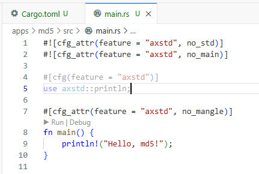

# 使用 ArceOSCoder 集成环境开发第一个 ArceOS 应用
关注 ArceOS 操作系统，缘起于：
> 像开发应用一样开发操作系统 https://github.com/chyyuu/thoughts/blob/main/tangram-oskits.md

#### 开箱即用的开发环境
为了方便对操作系统开发感兴趣的朋友/同学，制作了一个基于 Docker 的开发者镜像，其中包含了 ArceOS 的编译环境和 VSCode 在线版的开发环境，以更低的试错成本更优雅地体验 ArceOS 系统应用开发。

#### 本文档适用于已经安装好 docker 环境的用户
```bash
# 如果出现版本号说明安装成功。
docker -v
```
> 

#### 下载并启动开发者镜像
```bash
# 启动开发者镜像
docker run -p 8080:8080 --name coder -d zerounnet/arceos_coder:latest
# 检查是否成功
docker ps
```

> 

#### 打开浏览器进入开发环境，并进入 arceos 开发目录
> http://localhost:8080/?folder=/root/arceos

> 

#### ctrl+` 打开终端，输入以下命令，编译 helloworld
```bash
# 进入arceos开发目录
cd /root/arceos/
# 检查是否成功
pwd
# 编译helloworld
make ARCH=riscv64 A=apps/helloworld run
```
> 

#### 如果出现这一步，恭喜你完成了实验环境的配置。
> 不成功基本都因为网络连通引起的，需要科学地进行网络配置。

> 

#### 新建一个应用，名为 md5
```bash
# 新建一个应用
mkdir apps/md5
cd apps/md5
# 初始化应用
cargo init --name arceos-md5
cat Cargo.toml
```
> 

#### 复制 helloworld 的 main.rs 到 md5 目录
```bash
# 复制helloworld的main.rs到md5目录
cd /root/arceos
cp apps/helloworld/src/main.rs apps/md5/src/
cat apps/md5/src/main.rs
```
> 

#### 修改 main.rs 文件，引入 axstd 库并编译应用，成功
```rust
// apps/md5/src/main.rs
println!("Hello, md5!");
```
> 
```toml
# apps/md5/Cargo.toml
axstd = { path = "../../ulib/axstd", optional = true }
```
> 
```bash
make ARCH=riscv64 A=apps/md5 run
```
> 

#### 引入 md5-rs 第三方库用于 md5 计算
> md5-rs 不依赖 std 库，可以直接在 ArceOS 中使用。
```bash
# 引入 md5-rs 库
cd apps/md5/
git clone https://github.com/magnetardev/md5-rs
cd /root/arceos/
```
> 

#### 添加依赖
```toml
# apps/md5/Cargo.toml
md5-rs = {path = "./md5-rs"}
```
> 

#### 按照 md5-rs 文档添加示例代码
```rust
// apps/md5/src/main.rs
// get the hash
let mut ctx = Context::new();
ctx.read(b"Hello, world");
let digest = ctx.finish();

// get digest as string
let hash = digest
    .iter()
    .map(|x| format!("{:02x}", x))
    .collect::<String>();
println!("{hash}"); // "bc6e6f16b8a077ef5fbc8d59d0b931b9"
```
> 

#### 编译应用，提示 String 和 format 错误
```bash
make ARCH=riscv64 A=apps/md5 run
```
> 

> 详见 https://rcore-os.cn/rCore-Tutorial-Book-v3/chapter1/2remove-std.html

#### 使用 axstd::string::String 替代原始 String，重新编译应用
> 详见 https://rcore-os.cn/arceos-tutorial-book/ch03-04.html
```toml
# apps/md5/Cargo.toml
axstd = { path = "../../ulib/axstd", features=["alloc"], optional = true }
```
> 
```rust
// apps/md5/src/main.rs
#[cfg(feature = "axstd")]
use axstd::string::String;
```
> 
```bash
make ARCH=riscv64 A=apps/md5 run
```
> 

#### 缺乏 format 宏，目前在 axstd 库中没有找到对应的宏，需要自己实现
```rust
// apps/md5/src/main.rs
// {:02x}表示将一个数字格式化为至少两位的十六进制数，如果数字不足两位，则在前面补 0。
// 创建了一个包含十六进制字符的数组 hex_chars。
// 对于 digest 中的每个字节，它将字节除以 16 并取结果的整数部分作为索引来查找对应的十六进制字符，然后将字节与 16 取余数作为索引来查找对应的十六进制字符。
// 这两个字符就是字节的十六进制表示。
let mut hash = String::new();
let hex = ['0', '1', '2', '3', '4', '5', '6', '7', '8', '9', 'a', 'b', 'c', 'd', 'e', 'f'];
for byte in digest.iter() {
    hash.push(hex[(byte / 16) as usize]);
    hash.push(hex[(byte % 16) as usize]);
}
println!("{hash}"); // "bc6e6f16b8a077ef5fbc8d59d0b931b9"
```
> 

#### 重新编译应用，成功
```bash
make ARCH=riscv64 A=apps/md5 run
```
> 如果出现这一步，恭喜你完成了第一个应用的开发。

> 